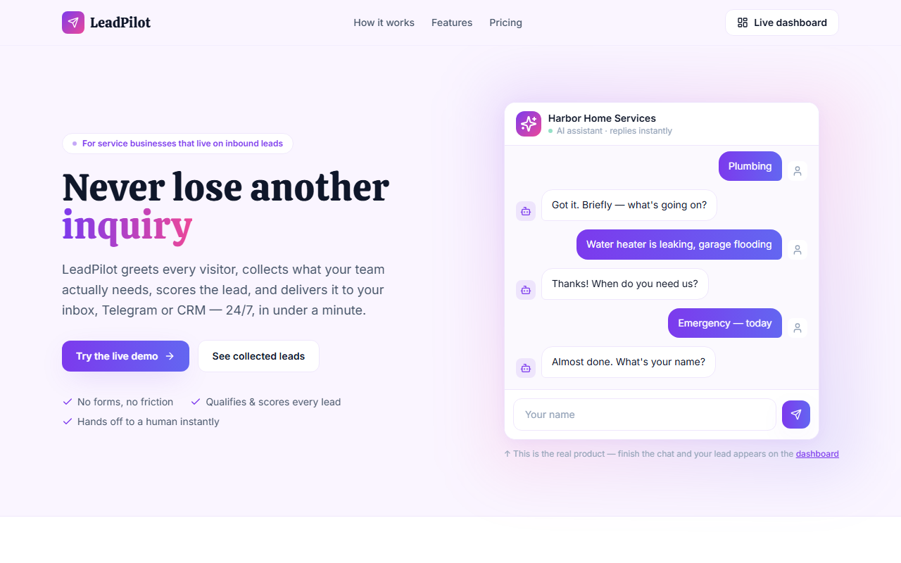

# LeadPilot — AI Lead-Intake Assistant for Service Businesses

Never lose another inquiry. LeadPilot greets every website visitor, walks them through a
guided intake conversation, scores the lead (hot / warm / cold), and hands it to the team —
with an AI summary, a full transcript, and optional Telegram delivery.

**Stack:** Next.js 14 (App Router) · TypeScript · Tailwind CSS · Framer Motion · Node API routes

🔗 **Live demo:** https://leadpilot-umber.vercel.app — finish the chat on the landing page and watch your lead appear on the [dashboard](https://leadpilot-umber.vercel.app/dashboard).



---

## ✨ What it does

- **Guided AI intake, not a form** — the assistant collects service, details, urgency, name and
  contact in a conversational flow. Visitors talk instead of hunting for a form.
- **Never derails** — the conversation runs on an explicit state machine: the assistant always
  knows what's collected and what's missing. The LLM enriches summaries — it never free-runs,
  never quotes prices, never invents availability (guardrails by design).
- **Lead scoring & routing** — urgency maps to hot/warm/cold; emergencies are flagged for
  instant dispatch.
- **AI summaries** — each lead gets a one-line summary for the team (OpenAI when a key is set,
  a clean rule-based fallback otherwise — the demo runs free).
- **Telegram handoff** — new leads ping your Telegram with score, contact and summary
  (set `TELEGRAM_BOT_TOKEN` + `TELEGRAM_CHAT_ID`).
- **Real subscription checkout** — the Growth plan button opens a hosted checkout session
  (Lemon Squeezy, test mode — same session + webhook pattern as Stripe Checkout). An
  HMAC-verified webhook confirms the subscription and notifies the team in Telegram.
  Try it with test card `4242 4242 4242 4242`.
- **Dashboard** — KPIs (total, hot, booked, est. recovered revenue), a leads table, and a
  detail drawer with the full conversation transcript.

## 🏗 Architecture

```
Next.js App Router
├─ /            landing + live intake widget (client component, state machine)
├─ /dashboard   leads table + KPIs + transcript drawer
└─ /api/leads   GET list · POST create → score → AI summary → Telegram notify
lib/store.ts    demo store (in-memory, seeded) — swap for Postgres/Supabase in production
```

## 🚀 Run locally

```bash
npm install
npm run dev        # http://localhost:3007
```

Zero configuration required. Optional env (see `.env.example`): `OPENAI_API_KEY` for LLM
summaries, `TELEGRAM_BOT_TOKEN`/`TELEGRAM_CHAT_ID` for lead delivery.

## 📦 Notes

- The demo business ("Harbor Home Services") and all seeded leads are fictional.
- Demo storage is in-memory so the dashboard is always alive; production would use
  Postgres/Supabase with the same API surface.

---

*Portfolio project by [Ilya Shapovalov](https://github.com/yagaMI-Reverse).*
